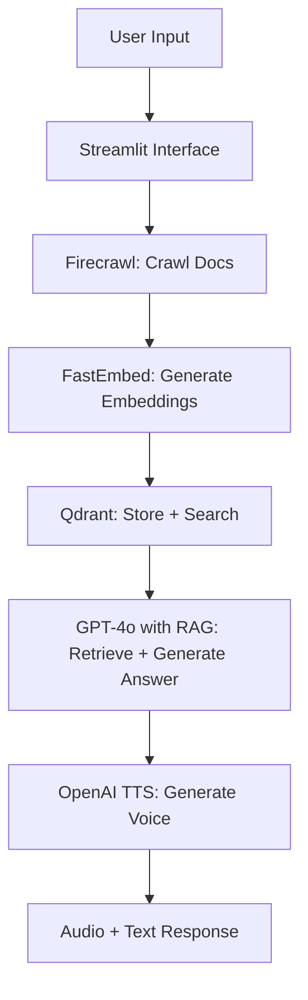

# 🎙️ Customer Support Voice Agent

A voice-enabled, AI-powered support assistant built with the OpenAI SDK. This application helps users query documentation in natural language and receive responses in both **text and speech**, making documentation more accessible and engaging.

The app uses **Retrieval-Augmented Generation (RAG)** to enhance response accuracy. It **retrieves relevant information from a given documentation URL** or website using **Firecrawl**, then lets users ask **any question** related to the content. The AI responds contextually using data pulled from the source documents.

It combines **Firecrawl**, **Qdrant**, **FastEmbed**, and **GPT-4o** with OpenAI's **Text-to-Speech (TTS)** capabilities to create a fully interactive support experience.

----------

## ✨ Key Features

### 🔍 Intelligent Knowledge Base with RAG

-   Crawls and parses documentation sites using **Firecrawl**
    
-   Converts crawled data into semantic embeddings with **FastEmbed**
    
-   Stores embeddings in a **Qdrant vector database** for fast semantic retrieval
    
-   Uses **Retrieval-Augmented Generation** (RAG) to answer questions based on retrieved chunks from the source
    

### 🧠 AI Agent Workflow

-   **Documentation Processor**: Retrieves relevant information from the given URL and generates contextual answers
    
-   **TTS Agent**: Converts answers into natural-sounding speech
    
-   **Voice Customization**: Choose from OpenAI’s voice models:
    
    -   `alloy`, `ash`, `ballad`, `coral`, `echo`, `fable`, `onyx`, `nova`, `sage`, `shimmer`, `verse`
        

### 🎛️ Streamlit Interface

-   Easy sidebar interface for API key and voice setup
    
-   Input any documentation URL to begin
    
-   Ask questions in natural language and receive answers via text and audio
    
-   Audio responses include browser playback and download support
    
-   Visual indicators for processing and loading
    

----------

## 🚀 Getting Started

### 1. Clone the Repository

```bash
git clone https://github.com/anandsuraj/customer-support-voice-agent.git
cd customer-support-voice-agent

```

### 2. Install Dependencies

```bash
pip install -r requirements.txt

```

### 3. Set Up API Keys

You’ll need API keys from:

-   🔑 [OpenAI Platform](https://platform.openai.com/) — for GPT and TTS
    
-   🔑 [Qdrant Cloud](https://cloud.qdrant.io/) — for vector search
    
-   🔑 [Firecrawl](https://www.firecrawl.dev/) — for web crawling
    

Enter the keys in the Streamlit sidebar.

### 4. Run the App

```bash
streamlit run customer_support_voice_agent.py

```

----------

## 🧩 System Architecture (with RAG)



----------

## 📌 Notes

-   Crawling depth defaults to 5 pages for performance
    
-   Crawl depth and configuration are customizable
    
-   Ensure API keys are valid and have active quota
    

----------

## 📄 License

This project is licensed under the [MIT License].

----------

## 🙌 Acknowledgements

-   [OpenAI](https://openai.com/) for GPT-4o and TTS
    
-   [Firecrawl](https://firecrawl.dev/) for crawling services
    
-   [Qdrant](https://qdrant.tech/) for fast vector search
    
-   [Streamlit](https://streamlit.io/) for the UI
    